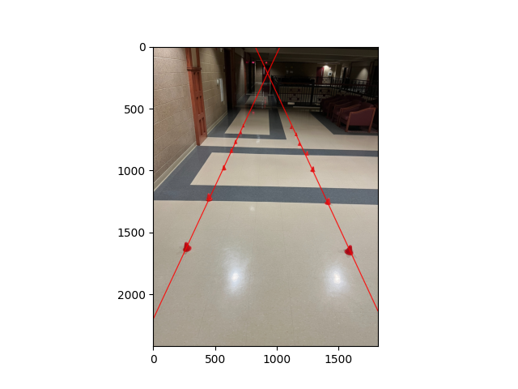

# Wisconsin Autonomous Perception Challenge

## Methodology
My solution is mostly inspired by razimgit's project which can be found here: https://gist.github.com/razimgit/d9c91edfd1be6420f58a74e1837bde18

The algorithm works as follows:
* Use a threshold to get a grey scale map of all the points with the approximate color of our cone
* Refine the map
* Find edges
* Get contours from the edges
* Simplify and refine contours
* Determine which contours "point up"
* Then split up all of the valid contours and get best fit lines for both

Let's clarify a few of these steps:
* Refine the map

Here's my code for doing this:
```
kernel = np.ones((5, 5))
img_thresh_opened = cv.morphologyEx(img_thresh, cv.MORPH_OPEN, kernel)

img_thresh_blurred = cv.medianBlur(img_thresh_opened, 5)
```
I'm using OpenCV's morphologyEx() function to open up the threshold map, and in doing so remove noise, and I'm using medianBlur() to smooth it out.

* Simplify and refine contours

My code is as follows:
```
img_edges = cv.Canny(img_thresh_blurred, 70, 255)

contours, _ = cv.findContours(np.array(img_edges), cv.RETR_EXTERNAL, cv.CHAIN_APPROX_SIMPLE)
img_contours = np.zeros_like(img_edges)
# Draws contours to a new image
cv.drawContours(img_contours, contours, -1, (255,255,255), 2)

approx_contours = []
for c in contours:
    approx = cv.approxPolyDP(c, 10, closed = True)
    approx_contours.append(approx)
img_approx_contours = np.zeros_like(img_edges)
cv.drawContours(img_approx_contours, approx_contours, -1, (255,255,255), 1)

all_convex_hulls = []
for ac in approx_contours:
    all_convex_hulls.append(cv.convexHull(ac))

img_all_convex_hulls = np.zeros_like(img_edges)
cv.drawContours(img_all_convex_hulls, all_convex_hulls, -1, (255,255,255), 2)


convex_hulls_3to10 = []
for ch in all_convex_hulls:
    if 3 <= len(ch) <= 10:
        convex_hulls_3to10.append(cv.convexHull(ch))
img_convex_hulls_3to10 = np.zeros_like(img_edges)
cv.drawContours(img_convex_hulls_3to10, convex_hulls_3to10, -1, (255,255,255), 2)
```
First I'm using the Canny edge detection algorithm, then I'm getting the contours. From there I approximate them with the the Douglas-Peucker algorithm and find their convex hulls. Then I simply remove any contours with more than 10 or less than 3 points.

* Determine which contours "point up"

Here's my algorithm for finding the convex hulls that point up:
```
def convex_hull_pointing_up(ch:np.ndarray) -> bool:
    points_above_center, points_below_center = [], []
    _, y, _, h = cv.boundingRect(ch) 
    vertical_center = y + h / 2

    for point in ch:
        if point[0][1] < vertical_center: 
            points_above_center.append(point)
        elif point[0][1] >= vertical_center:
            points_below_center.append(point)

    
    x_above, _, w_above, _ = cv.boundingRect(np.array(points_above_center)) 

    x_below, _, w_below, _ = cv.boundingRect(np.array(points_below_center))

    return x_above <= x_below + w_below and x_above + w_above <= x_below + w_below \
        and x_above >= x_below and x_above + w_above >= x_below
```
All it's doing is first finding the average y-value of the points, giving us a horizontal line by which we can split the points up into the "top" points and "bottom" points. From this all we check is whether all of the topmost points are between the rightmost and leftmost x-values of the bottom points, meaning the shape will generally point up.

## What did I try
The challenge went pretty smoothly for me. The thing I am most dissatisfied with is finding the two "lane lines". I ended up just arbitrarily splitting the points down the middle and then getting a best fit line for both.

## What libraries did I use
I used Python as my main language as well as OpenCV, matplotlib, numpy and scipy.